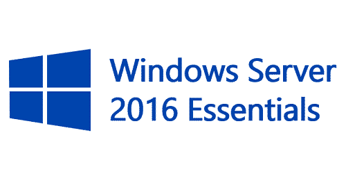

# Windows Server Essentials 2016 Deployment
Installed and configured Windows Server 2016 Essentials for a non-profit organization, enabling centralized user management and secure access to resources. 

## Environments and Technologies Used

- Lenovo TS RS160 E3

## Operating Systems Used

- Windows Server 2016 Essentials
- Windows 10

## High-Level Deployment and Configuration Steps

- Install the Windows Server Essentials operating system
- Configure the Windows Server Essentials operating system
- Create user accounts
- Create server folders for file sharing
- Setup server backup
- Connected client machines using the "Connect a Computer" wizard

<h2>Architecture Diagram</h2>

